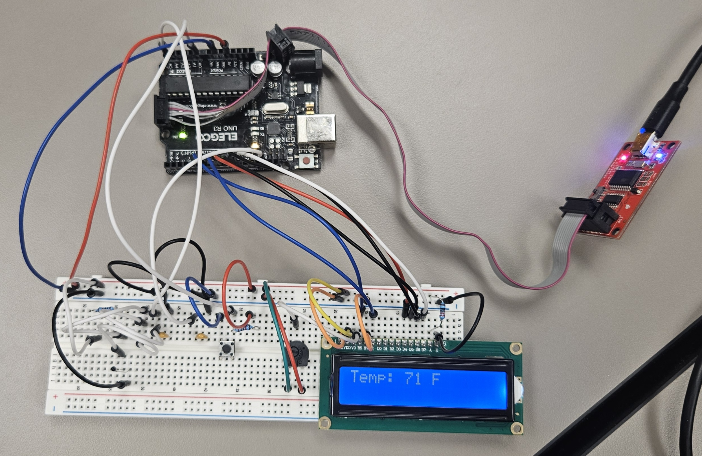

# AVR Thermistor-Based Temperature Display

## Project Hardware Setup

Below is a photo of the breadboarded system using an Arduino (ATmega328P):



This setup includes:
- A thermistor connected to PC5 (ADC5)
- A button connected to PC0 with a pull-up resistor
- An LCD connected to PD6, PD7, PB0–PB3
- 8 LEDs connected to PORTD (PD0–PD7)

This layout demonstrates how the microcontroller reads temperature and provides real-time feedback on the LCD.


## Overview

This project reads temperature data from a thermistor connected to an ATmega328P microcontroller.  
It displays the temperature on an LCD screen in **Celsius or Fahrenheit**, based on a **button toggle**, and provides a **visual representation** of the reading using **PORTD LEDs**.

## File Descriptions

- **thermometer.c**: Main application logic that reads ADC, processes temperature, and controls display and LEDs.
- **lcd.c / lcd.h**: LCD driver for initializing and writing messages to the display.
- **ledbyte.c / ledbyte.h**: LED driver to output ADC values to PORTD.
- **delay.S / delay.h**: Provides microsecond and millisecond software delay functions.
- **Makefile**: Contains build rules to compile and generate the firmware HEX file.

## Hardware Configuration

- **Thermistor Input**: ADC Channel 5 (PC5 / Pin 28)
- **LCD Pins**:  
  - RS - PD6  
  - ENABLE - PD7  
  - DB4 - PB0  
  - DB5 - PB1  
  - DB6 - PB2  
  - DB7 - PB3
- **LED Display**: PORTD (PD0 - PD7)
- **Unit Toggle Button**: PC0 (Pull-up enabled, toggles °C/°F)

## Build and Flash

1. Open terminal in the project directory.
2. Run `make` to build the firmware.
3. Flash the `.hex` file to the ATmega328P.

Example flashing command:
```bash
avrdude -c usbasp -p m328p -U flash:w:your_project.hex:i

